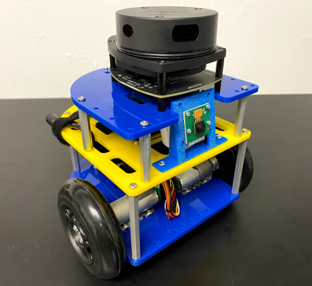
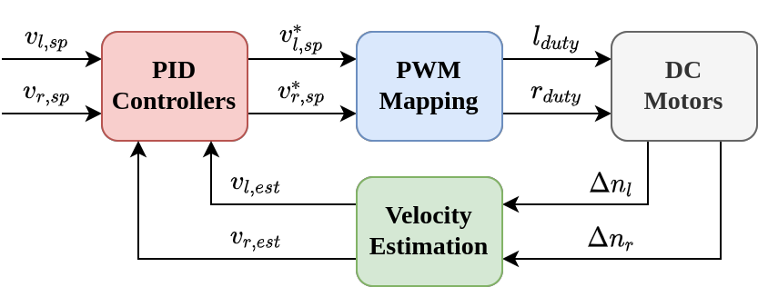
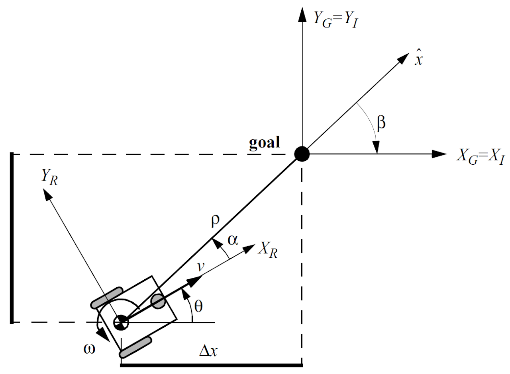
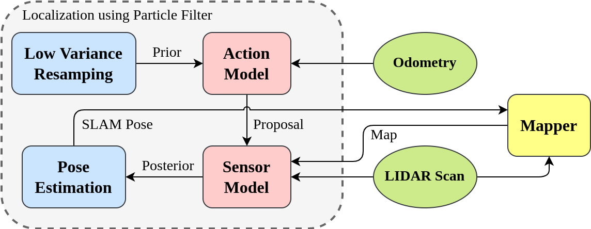
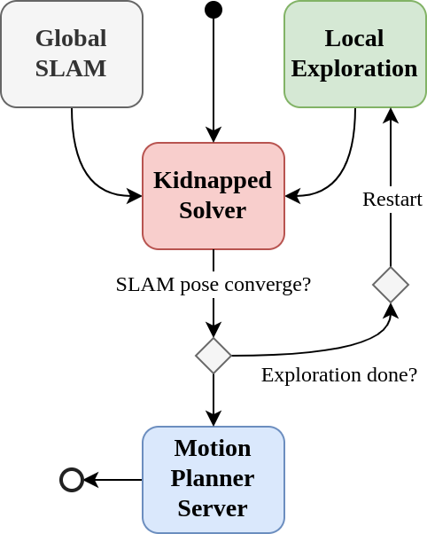

# ROB 550 Botlab
The Botlab is designed to explore the fundamentals of robot autonomy by developing a robot with autonomous mapping, localization, and exploration capabilities. 
In the Botlab, movement control, obstacle detection, maze exploration, and self-localization functionality will be developed on the MBot robot, a mobile robot platform.

## Motion Controller
Motion control can be separated into three hierarchical levels: 
- Wheel PID controllers 
- Nonholomic state feedback controller

The wheel controllers are responsible for maintaining the speed of individual wheels in response to set-point inputs by controlling the duty cycle of PWM signals sent to wheel motor drivers through a open loop duty mapping plus a PID feedback term.

The motion controller further abstracts robot control by taking an input path of waypoints, and generating velocity set-points that result in the robot following the path. It uses the nonholonomic drive model, and computes the linear and angular velocities such that the deviations in *x* and *y* direction are driven to zero.

## SLAM
Occupancy-grid based mapping was combined with Monte Carlo localization to create a SLAM system.
It consists of the action model, the sensor model, and the particle filter. In addition to maintaining a map of the robot's environment, SLAM is also responsible for outputting a single estimate of the robot's pose at each timestep. To do this in an outlier-robust way, the most likely 10% of particles are selected, and their likelihood-weighted mean pose is used as the SLAM pose estimate.

## Planning and Exploration
Planning and exploration components are the highest level of abstraction, making use of SLAM and motion control systems. 
Path planning is implemented using the A* algorithm, and the motion controller is used to execute paths that explore these areas. 
During exploration, the planner attempts to find paths from the robot to the center of each frontier, and the nearest frontier is selected as an exploration target, where frontiers are identified by searching for unobserved cells which are adjacent to observed unoccupied cells.

This demo video shows a solution to the global localization problem, where the global map is given but the robot starts at a unknown initial pose. 

https://user-images.githubusercontent.com/44640904/212575563-97fcfa00-b8ad-47fc-a2c0-fd5095b8317b.mp4
